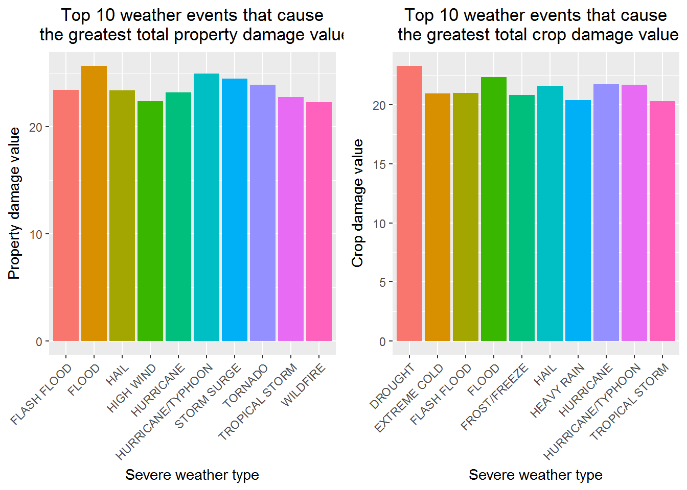
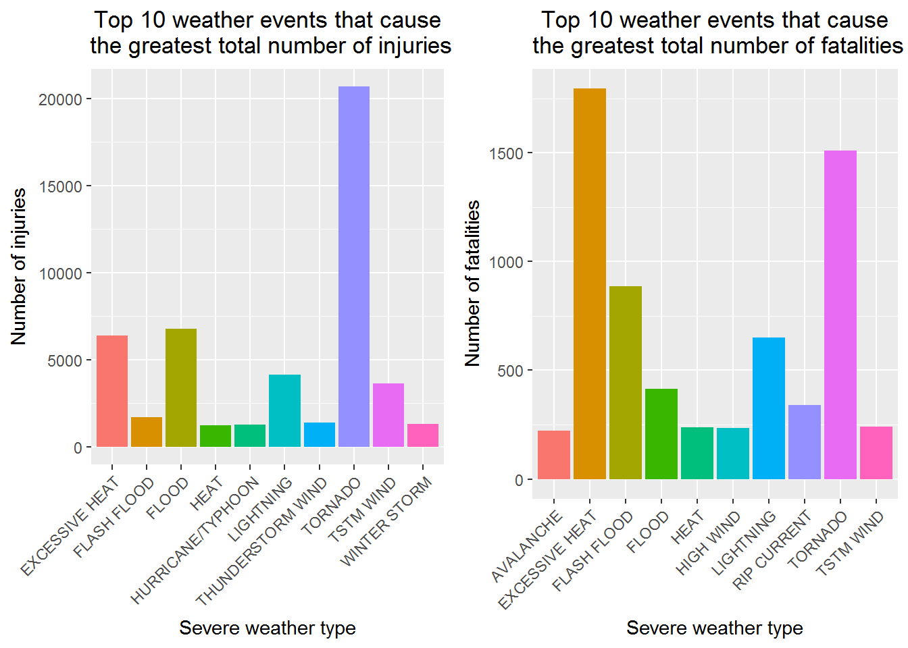

# Exploring the damage caused by various weather types across the US
Bishoy Sharobim  
25/05/2015 

## Synopsis
The aim of this data analysis is to explore the U.S. National Oceanic and Atmospheric Administration's (NOAA) storm database to address two key questions, which are: (1) Across the United States, which types of events (as indicated in the EVTYPE variable) are most harmful with respect to population health? (2) Across the United States, which types of events have the greatest economic consequences?

I hypothesise that  drought would cause the great economic damage, while flooding would cause the greatest population damage. The data used for this investigation was a tall and thin 47 MB Storm data spreadsheet containing  characteristics of major storms and weather events in the US, including when and where they occur, as well as estimates of any fatalities, injuries, and property damage. 

To complete the analysis, data recorded after 1996 was subsetted as it was only then they started to record many more event types and only 13 out of the 37 variables were considered as the others were superflous for my purposes. To address the first question, the main variables analysed were the "EVTYPE", "FATALITIES" and "INJURIES" and for the second question, it was "EVTYPE", "PROPDMG", "PROPDMGEXP", "CROPDMG" and "CROPDMGEXP".

The results of the analysis led me to conclude that considering total population health, excessive heat and tornados are the most hamful. Tornados cause the most injuries by a large gap, whilst excessive heat causes the most deaths. The events that cause the most economic damage are floods. Droughts and floods cause the most crop damage, whilst floods and hurricanes/typhoons cause the most property damage.

<br>

## Data Procesing

```r
knitr::opts_chunk$set(cache=TRUE)
```

<br> 

**Downloading and reading data into R**  
The data was downloaded from where it is stored online onto my local hard drive. 

I loaded all my required packages:  
* ggplot - which I use to do all my plotting.  
* gridExtra - which I use to combine plots by ggplot into one.  
* R.utils - which I use to unzip bz2 files (a rare format file).  

Please note, the viewers of this document must download these packages if they are absent on their system.

The downloaded Stormdata was unzipped using the R.utils package. After that it was loaded into R using the read.csv function.


```r
    setwd("C:/Users/User/Desktop/Cabinet/Career/Data Analysis/R/Coursera/5) Reproducible Research/Week 4/Peer Assessment 2")

    #Loading required packages. 
    library(ggplot2)
    library(gridExtra)
    library(R.utils)

    URL <- "https://d396qusza40orc.cloudfront.net/repdata%2Fdata%2FStormData.csv.bz2"
    
    if(!file.exists("./stormData.csv.bz2")){
    download.file(URL,"./stormData.csv.bz2")}
    
    if(!file.exists("./stormData.csv")){
    bunzip2("stormData.csv.bz2", remove=FALSE)}

    
    #Reading Stormdata table & saving workspace image.
    if(file.exists("./.Rdata")){
    load("./.Rdata")}
    
    if(!exists("Stormdata")){
    Stormdata <- read.csv("./StormData.csv")
    save.image("./.Rdata")}
```

<br>

**Exploring data**  
Below I explore the data looking at the variable names of Stormdata, the dimension of the data, the first few observations of the data, etc.

I also examine how many unique elements there are in the EVTYPE variable. This gives 985 unique values.

And I also examine the differnet type of events that are recorded across different years.


```r
    names(Stormdata)
```

```
##  [1] "STATE__"    "BGN_DATE"   "BGN_TIME"   "TIME_ZONE"  "COUNTY"    
##  [6] "COUNTYNAME" "STATE"      "EVTYPE"     "BGN_RANGE"  "BGN_AZI"   
## [11] "BGN_LOCATI" "END_DATE"   "END_TIME"   "COUNTY_END" "COUNTYENDN"
## [16] "END_RANGE"  "END_AZI"    "END_LOCATI" "LENGTH"     "WIDTH"     
## [21] "F"          "MAG"        "FATALITIES" "INJURIES"   "PROPDMG"   
## [26] "PROPDMGEXP" "CROPDMG"    "CROPDMGEXP" "WFO"        "STATEOFFIC"
## [31] "ZONENAMES"  "LATITUDE"   "LONGITUDE"  "LATITUDE_E" "LONGITUDE_"
## [36] "REMARKS"    "REFNUM"
```

```r
    dim(Stormdata)
```

```
## [1] 902297     37
```

```r
    object.size(Stormdata)
```

```
## 429322384 bytes
```

```r
    Stormdata[1:5, 1:5]
```

```
##   STATE__           BGN_DATE BGN_TIME TIME_ZONE COUNTY
## 1       1  4/18/1950 0:00:00     0130       CST     97
## 2       1  4/18/1950 0:00:00     0145       CST      3
## 3       1  2/20/1951 0:00:00     1600       CST     57
## 4       1   6/8/1951 0:00:00     0900       CST     89
## 5       1 11/15/1951 0:00:00     1500       CST     43
```

```r
    t(Stormdata[1:3, -2])
```

```
##            1         2         3        
## STATE__    "1"       "1"       "1"      
## BGN_TIME   "0130"    "0145"    "1600"   
## TIME_ZONE  "CST"     "CST"     "CST"    
## COUNTY     "97"      " 3"      "57"     
## COUNTYNAME "MOBILE"  "BALDWIN" "FAYETTE"
## STATE      "AL"      "AL"      "AL"     
## EVTYPE     "TORNADO" "TORNADO" "TORNADO"
## BGN_RANGE  "0"       "0"       "0"      
## BGN_AZI    ""        ""        ""       
## BGN_LOCATI ""        ""        ""       
## END_DATE   ""        ""        ""       
## END_TIME   ""        ""        ""       
## COUNTY_END "0"       "0"       "0"      
## COUNTYENDN NA        NA        NA       
## END_RANGE  "0"       "0"       "0"      
## END_AZI    ""        ""        ""       
## END_LOCATI ""        ""        ""       
## LENGTH     "14.0"    " 2.0"    " 0.1"   
## WIDTH      "100"     "150"     "123"    
## F          "3"       "2"       "2"      
## MAG        "0"       "0"       "0"      
## FATALITIES "0"       "0"       "0"      
## INJURIES   "15"      " 0"      " 2"     
## PROPDMG    "25.0"    " 2.5"    "25.0"   
## PROPDMGEXP "K"       "K"       "K"      
## CROPDMG    "0"       "0"       "0"      
## CROPDMGEXP ""        ""        ""       
## WFO        ""        ""        ""       
## STATEOFFIC ""        ""        ""       
## ZONENAMES  ""        ""        ""       
## LATITUDE   "3040"    "3042"    "3340"   
## LONGITUDE  "8812"    "8755"    "8742"   
## LATITUDE_E "3051"    "   0"    "   0"   
## LONGITUDE_ "8806"    "   0"    "   0"   
## REMARKS    ""        ""        ""       
## REFNUM     "1"       "2"       "3"
```

```r
    unique(Stormdata$"EVTYPE")[1:20]
```

```
##  [1] TORNADO                   TSTM WIND                
##  [3] HAIL                      FREEZING RAIN            
##  [5] SNOW                      ICE STORM/FLASH FLOOD    
##  [7] SNOW/ICE                  WINTER STORM             
##  [9] HURRICANE OPAL/HIGH WINDS THUNDERSTORM WINDS       
## [11] RECORD COLD               HURRICANE ERIN           
## [13] HURRICANE OPAL            HEAVY RAIN               
## [15] LIGHTNING                 THUNDERSTORM WIND        
## [17] DENSE FOG                 RIP CURRENT              
## [19] THUNDERSTORM WINS         FLASH FLOOD              
## 985 Levels:    HIGH SURF ADVISORY  COASTAL FLOOD ... WND
```

```r
    I1 <- grep("1995", Stormdata$"BGN_DATE")[1]
    head(data.frame(summary(Stormdata$"EVTYPE"[1:I1])),20)
```

```
##                        summary.Stormdata.EVTYPE.1.I1..
## TSTM WIND                                        90963
## HAIL                                             61832
## TORNADO                                          34764
## FREEZING RAIN                                        1
##    HIGH SURF ADVISORY                                0
##  COASTAL FLOOD                                       0
##  FLASH FLOOD                                         0
##  LIGHTNING                                           0
##  TSTM WIND                                           0
##  TSTM WIND (G45)                                     0
##  WATERSPOUT                                          0
##  WIND                                                0
## ?                                                    0
## ABNORMAL WARMTH                                      0
## ABNORMALLY DRY                                       0
## ABNORMALLY WET                                       0
## ACCUMULATED SNOWFALL                                 0
## AGRICULTURAL FREEZE                                  0
## APACHE COUNTY                                        0
## ASTRONOMICAL HIGH TIDE                               0
```

```r
    I2 <- grep("1996", Stormdata$"BGN_DATE")[1]
    head(data.frame(summary(Stormdata$"EVTYPE"[1:I2])),20)
```

```
##                    summary.Stormdata.EVTYPE.1.I2..
## TSTM WIND                                    91278
## HAIL                                         80946
## TORNADO                                      37498
## THUNDERSTORM WINDS                           20843
## FLASH FLOOD                                   3278
## LIGHTNING                                     2551
## HEAVY SNOW                                    1708
## HIGH WINDS                                    1532
## THUNDERSTORM WIND                             1161
## FLOOD                                         1079
## FUNNEL CLOUD                                   781
## FLASH FLOODING                                 681
## FLOOD/FLASH FLOOD                              624
## WATERSPOUT                                     406
## HIGH WIND                                      305
## URBAN FLOOD                                    246
## HEAVY RAIN                                     214
## SNOW                                           192
## ICE STORM                                      127
## FLOODING                                       120
```

<br>

Through the exploration, we find that before 1996, they only record TSTM WIND, HAIL, TORNADO. Whilst from 1997, they record over 20 events.

Below are provided definitions for most of the 37 variables of the dataset:

1. State: The code FIPS identifier of the state where the event/s took place.
2. BGN_DATE: Beginning date of the event/s.
3. BGN_TIME: Beginning time of the event/s.
4. TIME_ZONE: timezone.
5. COUNTY: code of county in which event/s occurred.
6. COUNTNAME: county name.
7. STATE: state in which event/s occurred.
8. EVYTPE: event type.
9. BGN_RANGE: beginning range of an event/s. Example: at the beginning of an event, snow ranged from 12 to 17 inches.
10. BGN_AZI: beginning azimuth of the event/s.
11.	BGN_LOCATI: beginning location of event/s.
12.	END_DATE: end date of the event/s.
13.	END_TIME: end time of the event/s.
14.	COUNTY_END: county in which event ended. All values are 0 .
15.	COUNTYENDN:.
16.	END_RANGE: ending range of an event/s.
17.	END_AZI: ending azimuth.
18.	END_LOCATI: ending location of an event/s.
19.	LENGTH: path length of a tornado (in miles and tenths of miles).
20.	WIDTH: path width of a tornado, in yardd.
21.	F: Fujita tornado intensity scale (F-scale). 
22.	MAG: magnitude, or Strength, of the event.
23.	FATALITIES: the number of people who died.
24.	INJURIES: the number of people who were injured.
25.	PROPDMG: property damage.
26.	PROPDMGEXP: exponent value for property damage.
27.	CROPDMG: crop damage.
28.	CROPDMGEXP: exponent value of crop damage.
29.	WFO: Weather forecast office. Wind Events are in KNOTS. Hail is in INCHES and TENTHS without the decimal (one and one-half are 150).
30.	STATEOFFIC: state office of where event occurred.
31.	ZONENAMES: zone name.
32.	LATITUDE:.
33.	LONGITUDE:
34.	LATITUDE_E:
35.	LONGITUDE_:
36.	REMARKS:
37.	REFNUM:

<br>

**Subsetting data**

The data was subsetted for observations recorded only after 1996 as previous years had very few event types recorded.

The columns were also subsetted to get rid of unnecessary variables.


```r
    Stormdata1 <- Stormdata[,c(2,5,7,8,12,20:28)]

    a <- grep("1996", Stormdata1$"BGN_DATE")[1]
    b <- dim(Stormdata1)[1]
    Stormdata2 <- Stormdata1[a:b,]
```

<br>

**(1) Across the United States, which types of events (as indicated in the EVTYPE variable) are most harmful with respect to population health?**

Below, we remove results where fatalities and injuries both equal to 0. 

The sum of all fatalities and injuies for different weather types across all years are obtained using the aggregate function.

To determine the most harmful weather types, we only consider the top 10 most harmful.


```r
    Stormdata3 <- Stormdata2[!(Stormdata2$"FATALITIES" == 0 & Stormdata2$"INJURIES" == 0),]

    #Fatalities
    A1 <- aggregate(FATALITIES ~ EVTYPE, Stormdata3, sum)
    B1 <- A1[unlist(sort(A1[,2], index.return=TRUE, decreasing=TRUE)[2]),]
    fatalities <- B1[1:10,]

    #Injuries
    A2 <- aggregate(INJURIES ~ EVTYPE, Stormdata3, sum)
    B1 <- A2[unlist(sort(A2[,2], index.return=TRUE, decreasing=TRUE)[2]),]
    injuries <- B1[1:10,]
```

<br>
We create column graph plots for the top 10 events which cause the most injuries and fatalities. 


```r
    fatalities1 <- ggplot(fatalities, aes(EVTYPE, FATALITIES, fill = EVTYPE)) +
        geom_bar(stat="identity") +
        theme(axis.text.x = element_text(hjust=1, angle = 45), legend.position = "none", plot.title = element_text(hjust = 0.5)) +
        xlab("Severe weather type") +
        ylab("Number of fatalities") +
        ggtitle("Top 10 weather events that cause\n the greatest total number of fatalities")

    injuries1 <- ggplot(injuries, aes(EVTYPE, INJURIES, fill = EVTYPE)) +
        geom_bar(stat="identity") +
        theme(axis.text.x = element_text(hjust=1, angle = 45), legend.position = "none", plot.title = element_text(hjust = 0.5)) +
        xlab("Severe weather type") +
        ylab("Number of injuries") +
        ggtitle("Top 10 weather events that cause\n the greatest total number of injuries")
```

<br>

**(2) Across the United States, which types of events have the greatest economic consequences?**

First, I remove all observations with no recorded property and crop damage. Then I deal with the PROPDMGEXP and CROPDMGEXP variables by assigning numerical values to their elements.

Following this, I create two new variables which provide an accurate representation of total crop damage and total property damage.


```r
    Stormdata5 <- Stormdata2[!(Stormdata2$"PROPDMG" == 0 & Stormdata2$"CROPDMG" == 0),]
    
    ED <- Stormdata5[,c(11:14)]
    
    
    #Examining the below 4 variables.
    summary(ED$PROPDMGEXP)
```

```
##             -      ?      +      0      1      2      3      4      5 
##   3681      0      0      0      0      0      0      0      0      0 
##      6      7      8      B      h      H      K      m      M 
##      0      0      0     32      0      0 183449      0   7363
```

```r
    summary(ED$CROPDMGEXP)
```

```
##           ?     0     2     B     k     K     m     M 
## 97949     0     0     0     2     0 94815     0  1759
```

```r
    summary(ED$PROPDMG)
```

```
##    Min. 1st Qu.  Median    Mean 3rd Qu.    Max. 
##    0.00    2.00    8.00   39.28   25.00 5000.00
```

```r
    summary(ED$CROPDMG)
```

```
##    Min. 1st Qu.  Median    Mean 3rd Qu.    Max. 
##   0.000   0.000   0.000   6.178   0.000 990.000
```

```r
    #Fixing up "PROPDMGEXP" and "CROPDMGEXP"
    ED$PROPDMGEXP <- as.character(ED$PROPDMGEXP)
    ED$CROPDMGEXP <- as.character(ED$CROPDMGEXP)
    
    ED$PROPDMGEXP[ED$PROPDMGEXP == "K"] <- 10^3
    ED$PROPDMGEXP[ED$PROPDMGEXP =="M"] <- 10^6
    ED$PROPDMGEXP[ED$PROPDMGEXP =="B"] <- 10^9
    ED$PROPDMGEXP[ED$PROPDMGEXP ==""] <- 0
    
    ED$CROPDMGEXP[ED$CROPDMGEXP == "K"] <- 10^3
    ED$CROPDMGEXP[ED$CROPDMGEXP =="M"] <- 10^6
    ED$CROPDMGEXP[ED$CROPDMGEXP =="B"] <- 10^9
    ED$CROPDMGEXP[ED$CROPDMGEXP ==""] <- 0
        
    ED$PROPDMGEXP <- as.numeric(ED$PROPDMGEXP)
    ED$CROPDMGEXP <- as.numeric(ED$CROPDMGEXP)
    
    FullCROPDMG <- ED$CROPDMG*ED$CROPDMGEXP
    FullPROPDMG <- ED$PROPDMG*ED$PROPDMGEXP
    
    TOTALDMG <- FullCROPDMG + FullPROPDMG
    
    Stormdata6 <- data.frame(Stormdata5, "FullCROPDMG" = FullCROPDMG, "FullPROPDMG" = FullPROPDMG, "TOTALDMG" = TOTALDMG)
```

<br>

Below, using the aggregate function, the total sum value of crop and the total sum value of property damage for different weather types across all years are obtained.


```r
    #Crop damage
    A1 <- aggregate(FullCROPDMG ~ EVTYPE, Stormdata6, sum)
    s6 <- unlist(sort(A1[,2], index.return=TRUE, decreasing=TRUE)[2])
    Crop <- data.frame(A1[s6,][1:10,])
    
    
    #Property damage
    A3 <- aggregate(FullPROPDMG ~ EVTYPE, Stormdata6, sum)
    s7 <- unlist(sort(A3[,2], index.return=TRUE, decreasing=TRUE)[2])
    Prop <- data.frame(A3[s7,][1:10,])
```

<br>

Now I plot the total damage values caused by the top 10 events that resulted in the highest recorded property and crop damage.


```r
    Crop1 <- ggplot(Crop, aes(x=EVTYPE, y=log(FullCROPDMG), fill = EVTYPE)) +
        theme(axis.text.x = element_text(angle = 45, hjust =1), legend.position = "none", plot.title = element_text(hjust = 0.5)) +
        geom_bar(stat="identity") +
        xlab("Severe weather type") +
        ylab("Crop damage value") +
        ggtitle("Top 10 weather events that cause\n the greatest total crop damage value")

    Prop1 <- ggplot(Prop, aes(x=EVTYPE, y=log(FullPROPDMG), fill = EVTYPE)) +
        theme(axis.text.x = element_text(angle = 45, 
        hjust = 1), legend.position = "none", plot.title = element_text(hjust = 0.5)) +
        geom_bar(stat="identity") +
        xlab("Severe weather type") +
        ylab("Property damage value") +
        ggtitle("Top 10 weather events that cause\n the greatest total property damage value")
```

<br>

## Results

Examining the economic damage and I inititate the call to plot...

```r
    Prop
```

```
##                EVTYPE  FullPROPDMG
## 46              FLOOD 143944833550
## 90  HURRICANE/TYPHOON  69305840000
## 139       STORM SURGE  43193536000
## 148           TORNADO  24616945710
## 44        FLASH FLOOD  15222203910
## 72               HAIL  14595143420
## 89          HURRICANE  11812819010
## 150    TROPICAL STORM   7642475550
## 86          HIGH WIND   5247860360
## 176          WILDFIRE   4758667000
```

```r
    Crop
```

```
##                EVTYPE FullCROPDMG
## 30            DROUGHT 13367566000
## 46              FLOOD  4974778400
## 89          HURRICANE  2741410000
## 90  HURRICANE/TYPHOON  2607872800
## 72               HAIL  2476029450
## 44        FLASH FLOOD  1334901700
## 41       EXTREME COLD  1288973000
## 59       FROST/FREEZE  1094086000
## 75         HEAVY RAIN   728169800
## 150    TROPICAL STORM   677711000
```

```r
    grid.arrange(Prop1, Crop1, ncol = 2)
```

<!-- -->

<br>

Examining the damage caused to populaton health and I initiate the call to plot...


```r
    fatalities
```

```
##             EVTYPE FATALITIES
## 26  EXCESSIVE HEAT       1797
## 115        TORNADO       1511
## 34     FLASH FLOOD        887
## 78       LIGHTNING        651
## 35           FLOOD        414
## 92     RIP CURRENT        340
## 118      TSTM WIND        241
## 49            HEAT        237
## 64       HIGH WIND        235
## 1        AVALANCHE        223
```

```r
    injuries
```

```
##                EVTYPE INJURIES
## 115           TORNADO    20667
## 35              FLOOD     6758
## 26     EXCESSIVE HEAT     6391
## 78          LIGHTNING     4141
## 118         TSTM WIND     3629
## 34        FLASH FLOOD     1674
## 112 THUNDERSTORM WIND     1400
## 134      WINTER STORM     1292
## 67  HURRICANE/TYPHOON     1275
## 49               HEAT     1222
```

```r
    grid.arrange(injuries1, fatalities1, ncol = 2)
```

<!-- -->

<br> 

## Conclusion  
Across the US, the events which are the most harmful with respect to population health are excessive heat and tornados. More specifically...  
* Excessive heat causes the greatest number of deaths, followed closely by tornados.   
* Considering injuries alone, Tornados are the biggest leading cause, far above other weather types.


Across the US, flood events are the most harmful economically. More specifically...  
* Droughts and floods cause the most crop damage.  
* Floods and hurricane/typhoon cause the most property damage.


